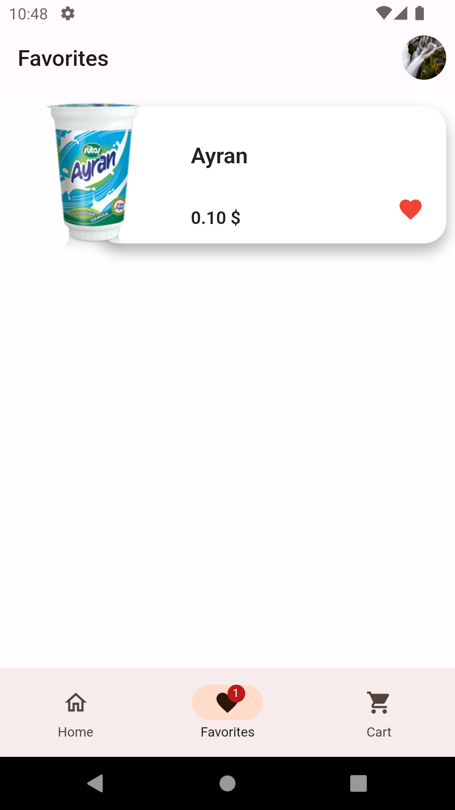

# Food App

A Flutter application for food enthusiasts to explore, save favorites, and manage their cart.

## Images

  
  
  
  

  
  

  
  
  

  
  
  

  
  
  

## Features

- **BLoC Pattern with Cubit:** Utilizes the BLoC pattern with Cubit for state management.
- **Localization (l10n):** Multi-language support(Turkish-English) implemented using `intl` package.
- **Network Requests:** Retrieves data using Dio for seamless API integration.
- **Cart Management:** Incorporates Dio for adding items to the cart.
- **Persistent Storage:** Utilizes Shared Preferences for storing user preferences/settings.
- **Animations:** Hero widgets and Lottie library for engaging and interactive animations.
- **Image Handling:** Allows users to pick images using `image_picker`.
- **Firebase Integration:**
  - User Authentication (`firebase_auth`)
  - Firestore for user data (`cloud_firestore`)
  - Google Sign-In (`google_sign_in`)
  - Firebase Storage for handling media (`firebase_storage`)

## Dependencies

- Flutter SDK
- `flutter_bloc: ^8.1.3`
- `dio: ^5.3.4`
- `lottie: ^2.7.0`
- `shared_preferences: ^2.2.2`
- `image_picker: ^1.0.4`
- Firebase packages (`firebase_core`, `cloud_firestore`, `firebase_auth`, `google_sign_in`, `firebase_storage`)
- `flutter_localizations` for localization
- `intl: ^0.18.0`

## License

This project is licensed under the MIT License - see the [LICENSE](LICENSE) file for details.
